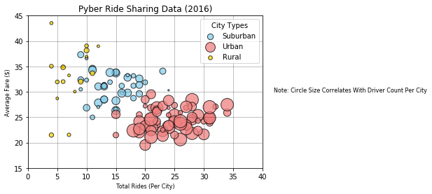

## Pyber: Observable Trends

* 1) Majority of drivers are located in Urban areas.
* 2) Urban areas have significantly more rides but lower fares on average than rural or suburban areas.
* 3) Average Fares for Suburban areas are similar to rural areas but with more drivers and fares.


```python
# Import Dependencies
import matplotlib.pyplot as plt
import pandas as pd
import numpy as np
import os
```


```python
#Create City DataFrame
csv_city=os.path.join('raw_data','city_data.csv')
city_df=pd.read_csv(csv_city)
```


```python
#Create Ride DataFrame
csv_ride=os.path.join('raw_data','ride_data.csv')
ride_df=pd.read_csv(csv_ride)
```


```python
#Create City DataFrame
city_ride_df=pd.merge(ride_df,city_df,on='city',how='outer')
```


```python
#Create city grouped DF and set variables
city_group=city_ride_df.groupby('city')
fare_avg=city_group['fare'].mean()
ride_count=city_group['ride_id'].count()
driver_count=city_group['driver_count'].mean()
city_type=city_group['type'].unique()
```


```python
#Create new DataFrame for set variables
ride_summary_table = pd.DataFrame({
    "Fare Average": fare_avg,
    "Rides Per City": ride_count,
    "Drivers Per City": driver_count,
    "City Type": city_type
})
```


```python
#Create Urban Summary DataFrame
urban_summary_df=ride_summary_table.loc[ride_summary_table['City Type']=='Urban']
fare_avg_u=urban_summary_df['Fare Average']
ride_count_u=urban_summary_df['Rides Per City']
driver_count_u=urban_summary_df['Drivers Per City']
```


```python
#Create Suburban Summary DataFrame
suburban_summary_df=ride_summary_table.loc[ride_summary_table['City Type']=='Suburban']
fare_avg_s=suburban_summary_df['Fare Average']
ride_count_s=suburban_summary_df['Rides Per City']
driver_count_s=suburban_summary_df['Drivers Per City']
```


```python
#Create Rural Summary DataFrame
rural_summary_df=ride_summary_table.loc[ride_summary_table['City Type']=='Rural']
fare_avg_r=rural_summary_df['Fare Average']
ride_count_r=rural_summary_df['Rides Per City']
driver_count_r=rural_summary_df['Drivers Per City']
```


```python
#Create Bubble Plot
plt.scatter(x=ride_count_s,y=fare_avg_s, s=driver_count_s*5,c='skyblue',edgecolors='black',alpha=0.75)
plt.scatter(x=ride_count_u,y=fare_avg_u,s=driver_count_u*5,c='lightcoral',edgecolors='black',alpha=0.75)
plt.scatter(x=ride_count_r,y=fare_avg_r,s=driver_count_r*5,c='gold',edgecolors='black',alpha=0.75)
plt.title('Pyber Ride Sharing Data (2016)',fontsize=12)
plt.legend(['Suburban','Urban','Rural'],title='City Types', loc='upper right', fancybox=True)
plt.xlabel('Total Rides (Per City)',fontsize=8)
plt.ylabel('Average Fare ($)',fontsize=8)
plt.xlim(0,40)
plt.ylim(15,45)
plt.grid(color='black',alpha=0.3)
plt.text(42,30,"Note: Circle Size Correlates With Driver Count Per City", fontsize=8)
plt.show()
```





```python
#Create DataFrame and variables for Pie Charts
city_type_df=city_ride_df.groupby('type')
fare_sum=city_type_df['fare'].sum()
ride_count=city_type_df['ride_id'].count()
driver_sum=city_type_df['driver_count'].sum()
fare_total=city_ride_df['fare'].sum()
ride_total=city_ride_df['ride_id'].count()
driver_total=city_ride_df['driver_count'].sum()
driver_per=driver_sum/drive_total
fare_per=fare_sum/fare_total
ride_per=ride_count/ride_total
```


```python
#Create % Fares by City Type Pie Chart
plt.pie(fare_per,labels=['Rural','Suburban','Urban'],colors=('gold','skyblue','lightcoral'),autopct="%1.0f%%",
        shadow=True,explode=(0,0,0.1), startangle=140)
plt.axis("equal")
plt.title('% of Total Fare by City Type',fontsize=12)
plt.show()
```


```python
plt.pie(ride_per,labels=['Rural','Suburban','Urban'],colors=('gold','skyblue','lightcoral'),autopct="%1.0f%%",
        shadow=True,explode=(0,0,0.1), startangle=140)
plt.axis("equal")
plt.title('% of Total Rides by City Type',fontsize=12)
plt.show()
```


```python
plt.pie(driver_per,labels=['Rural','Suburban','Urban'],colors=('gold','skyblue','lightcoral'),autopct="%1.0f%%",
        shadow=True,explode=(0,0,0.1), startangle=140)
plt.axis("equal")
plt.title('% of Total Drivers by City Type',fontsize=12)
plt.show()
```


